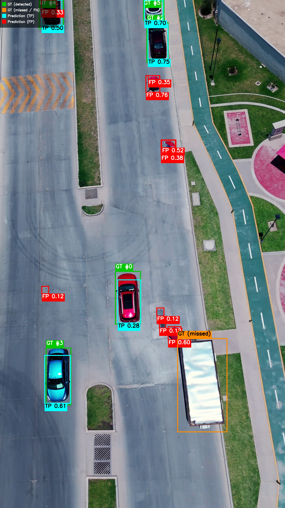
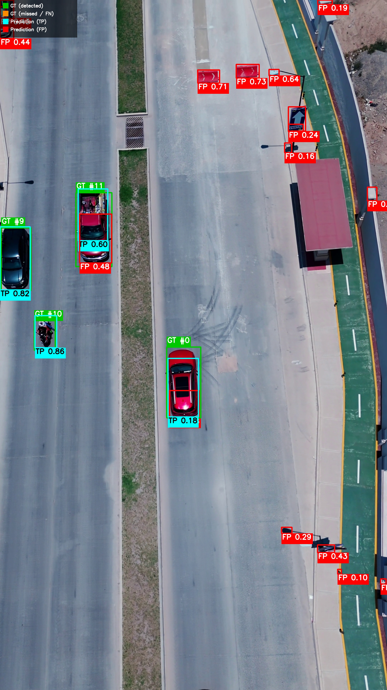
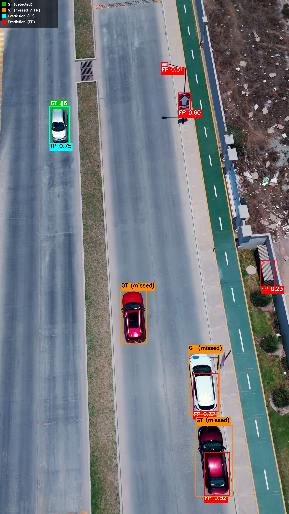

# Aerial Vehicle Detection

Zero-shot-labeled, human-reviewed, leave-one-video-out validated YOLOv8 vehicle detector for aerial/drone footage, evaluated on a manually-tracked held-out video.

## Overview

Task: detect vehicles (single class) in aerial drone footage. Inputs: four short training videos (A/B/C/D) and one official held-out evaluation video.

Constraints that shaped every decision below:
- ~8 hour engineering scope — pipeline correctness and reproducibility over squeezing out maximum score.
- Training labels must be model-generated (zero-shot), not hand-annotated from scratch; light manual cleanup is allowed.
- No pretraining/fine-tuning on labeled aerial datasets (VisDrone/UAVDT/AU-AIR) — zero-shot only for pseudo-labeling.
- The official eval video must never be used for training, threshold tuning, or model selection.

```
raw video → frame extraction → zero-shot pseudo-labeling → automatic cleanup
→ CVAT manual review → detector training → leave-one-video-out (LOVO) validation
→ confidence-operating-point selection → final model (A+B+C+D) → held-out evaluation
```

## Data

Kept intentionally minimal — only properties that drove an engineering decision below.

| | Video A | Videos B/C/D | Official eval |
|---|---|---|---|
| Resolution | 1920×1080 | 3840×2160 | 2160×3840 (portrait) |
| Camera | approximately static | moving / changing angle | — |
| Frames used | 39 | 63 / 34 / 49 | 918 |
| Sampling | 2 FPS | 2 FPS | 30 FPS (native) |

- Training frames sampled at **2 FPS** (`configs/data/pexels_aerial.yaml`, historical run config) — adjacent frames in the same ~20–30s clip are highly redundant; 2 FPS keeps the dataset small enough for the scope while retaining visual diversity. 185 training frames total (A=39, B=63, C=34, D=49).
- Video A's static camera is what makes a stationary-detection heuristic viable there (§ Video A cleanup) and nowhere else.
- B/C/D's 4K source resolution, plus small vehicle size at range, is why training uses `imgsz=1920` instead of the YOLO default 640 (§ Training).
- The eval video's 918 frames @ 30 FPS (30.6s) are the basis for the false-alarms/min and TTFD calculations (§ Evaluation).

## Pseudo-label generation

### Zero-shot labeling (Grounding DINO)

`src/autolabel/zero_shot.py`, driven by `scripts/run_autolabel.py` / `configs/autolabel.yaml`. Manual from-scratch annotation was deliberately avoided per the task's model-generated-labels requirement.

The configuration evolved during actual experimentation (visible in `outputs/2026-08-22/*/.hydra/config.yaml`):

1. **First pass**: `IDEA-Research/grounding-dino-tiny`, prompt `"a car. a truck. a vehicle."`, `box_threshold=0.2`. Inspecting the CVAT import showed many missed vehicles and duplicate/nested boxes (one physical vehicle producing 2–3 overlapping boxes) — the tiny model's recall on small aerial vehicles was insufficient, and the multi-phrase prompt let one object independently match several phrases.
2. **Final pass** (`configs/autolabeler/gdino_b015_t015_nms05_c08.yaml`): switched to `IDEA-Research/grounding-dino-base`, collapsed the prompt to a single concept `"vehicle."` (removes the multi-phrase duplicate-match source directly), and lowered `box_threshold=0.15` / `text_threshold=0.15` to push recall further — at the cost of more false positives, addressed in cleanup below.

### Duplicate / nested-box cleanup

Standard NMS (`nms_iou_threshold=0.5`) doesn't catch a small box nested *inside* a large one for the same vehicle — their IoU is low even though one is almost entirely contained in the other. `apply_containment_filter` in `zero_shot.py` adds a second pass: `containment_ratio = intersection_area / area_of_smaller_box`; above `containment_threshold=0.8`, the lower-confidence box is dropped. Plain NMS is *not* tightened further (e.g. to a lower IoU) because Video C has dense traffic with legitimately overlapping neighboring-vehicle boxes — an aggressive single-threshold IoU cut would delete real detections there. Per-frame debug JSON (raw boxes, confidence, `survived_nms`, `removed_by_containment`) is written alongside the YOLO `.txt` labels for diagnosability, without changing the label format itself.

### Video-A-specific temporal cleanup

`src/autolabel/temporal_filter.py`, gated to `target_video_id: train_A` (`configs/temporal_filter/default.yaml`). Because **Video A's camera is approximately static**, a detection that stays in almost exactly the same normalized position/size across many consecutive sampled frames *and* has persistently low confidence is a plausible systematic false positive (e.g. a fixed background artifact). This is a single greedy nearest-neighbor frame-to-frame chainer — not a tracker, no optical flow, no re-identification — that flags (never auto-removes on stationarity alone) sequences meeting all of: `min_track_length=6` frames (~2.5s), `max_center_distance=0.005`, `max_size_change=0.10`, mean confidence ≤ `max_confidence=0.50`. A confidently-detected stationary/parked vehicle is left alone.

This is applied **only** to Video A: B/C/D have real camera motion, so "stationary across frames" stops being a meaningful false-positive signal there — it would just as easily flag a real vehicle the camera happens to track smoothly.

### CVAT manual review

Pseudo-labels + automatic cleanup were imported into CVAT and reviewed by hand. The review was **light and targeted**, not an exhaustive re-annotation: removing remaining false positives / duplicates, correcting clearly wrong boxes, adding a small number of obviously missed vehicles.

```
zero-shot pseudo-labels → automatic cleanup (NMS + containment [+ temporal, A only]) → CVAT review → human-reviewed pseudo-labels
```

Final training annotations live in `data/train_dataset/gt_labels/train/` and are referred to throughout as **human-reviewed pseudo-labels** — not claimed as ground truth. `data/train_dataset/pseudo_labels/train/` (the pre-review, cleaned auto-label output) is kept for reference only and not used in training or evaluation.

## Training

### Why not a random frame-level split

Each source clip is only ~20–30 seconds; adjacent frames within one clip are highly correlated. A random frame-level train/validation split would put near-duplicate scenes (e.g. frame *N* and frame *N*+1) on both sides of the split, producing unrealistically optimistic validation metrics that don't reflect generalization to a new scene.

### Leave-one-video-out (LOVO) validation

`src/data/lovo_split.py`. Four folds, each holding out one entire video:

| Fold | Train | Validation |
|---|---|---|
| A | B+C+D | A |
| B | A+C+D | B |
| C | A+B+D | C |
| D | A+B+C | D |

The four fold models are **not an ensemble** — their only purpose is estimating cross-scene generalization and selecting the inference operating point before touching the official eval video. `build_fold` raises hard `AssertionError`s if validation ever contains anything but the held-out video, if training ever contains the held-out video, or if any image appears in both splits. No images/labels are physically duplicated: one directory symlink (`data/train_dataset/labels → gt_labels`, required because Ultralytics resolves GT by substituting `images/`→`labels/` in each image path) plus a generated `train.txt`/`val.txt`/`dataset.yaml` per fold.

### Detector

`configs/model/yolov8.yaml` / `configs/trainer/default.yaml`:

| | |
|---|---|
| Model | YOLOv8s, COCO-pretrained (`yolov8s.pt`) |
| Classes | 1 (`vehicle`) |
| Image size | 1920 |
| Epochs / patience | 100 / 30 (early-stopped by patience where triggered) |
| Batch size | 16 |
| Optimizer / lr0 | auto / 0.01 |
| Seed / deterministic | 0 / true |

**YOLOv8s**, not a larger variant: the dataset is small and heterogeneous (185 human-reviewed frames across 4 different scenes) — a bigger model risks overfitting capacity the data can't support, while "s" stays fast and easy to reproduce on general-purpose COCO weights (no aerial-pretrained checkpoint, per the No Cheat constraint).

**`imgsz=1920`**, not the YOLO default 640: source frames run up to 3840×2160 with genuinely small vehicles at range; downscaling to 640 would shrink distant vehicles to a handful of pixels before the model ever sees them. VRAM was not the limiting resource on the training GPU, so resolution was the lever worth spending on, not model capacity.

Actual epochs logged per run (`results.csv`): Fold A 76, Fold B 66, Fold C 100 (no early stop), Fold D 31, final (`fold=all`) 100.

### Inference operating point

`configs/inference/default.yaml`, reused identically everywhere (LOVO eval, final eval): `nms_iou_threshold=0.5`, `matching_iou_threshold=0.5`, `max_det=100`, `strategy=full_frame` (tiled/sliding-window inference is a defined-but-unimplemented seam in `src/models/inference.py` for future comparison, not built this round).

## Confidence threshold selection

The initial default `confidence_threshold=0.25` was far too conservative — Fold A at that threshold: Detection Rate 0.165, Precision 0.832 (high precision, most vehicles missed). A confidence sweep was run **using only the four LOVO folds**, thresholds `[0.05, 0.075, 0.10, 0.125, 0.15]`, everything else fixed (`scripts/evaluate_detector.py` + `src/metrics/confidence_sweep.py`, one inference pass per fold, filtered post-hoc — exact, not approximate, since NMS is confidence-greedy).

Cross-fold aggregate at `confidence=0.10` (`outputs/cross_fold_confidence_sweep.json`):

| | Detection Rate | Precision | False Alarms/min |
|---|---|---|---|
| mean ± std | 0.484 ± 0.162 | 0.487 ± 0.305 | 3080 ± 4051 |
| worst fold | 0.314 (A) | 0.207 (B) | 9054 (D) |

`confidence=0.10` was selected as the practical compromise across this sweep and **fixed before the official evaluation ran**. `max_det=100`, `nms_iou_threshold=0.5`, `matching_iou_threshold=0.5` were fixed alongside it. None of these were revisited after seeing official-eval results.

**Caveat found during the sweep**: at `confidence≤0.10`, Fold D's held-out predictions saturate `max_det=100` (100% of its 49 frames hit the cap, identical raw counts at 0.05/0.075/0.10) — its true false-positive rate at this end of the sweep is a floor, not an exact count. Folds A/B/C never saturate.

## LOVO results (at the selected operating point, confidence=0.10)

| Fold | Held-out | Detection Rate | Precision | False Alarms/min | mAP@0.5 |
|---|---|---|---|---|---|
| A | A | 0.314 | 0.808 | 339 | 0.513 |
| B | B | 0.637 | 0.207 | 2103 | 0.447 |
| C | C | 0.608 | 0.685 | 826 | 0.650 |
| D | D | 0.377* | 0.246* | 9054* | 0.180 |

\* Fold D at `max_det` saturation — see caveat above; true FP rate likely higher, detection rate potentially different.

Generalization varies substantially by held-out scene (Detection Rate range 0.31–0.64, Precision range 0.21–0.81) — exactly the kind of domain shift a random split would have hidden. Fold D is the weakest scene by a wide margin (lowest mAP, highest false-alarm rate, and the only fold where inference saturates `max_det`).

## Final model

One detector trained on **all four** human-reviewed training videos combined (`fold=all`), using the model/resolution/training settings fixed above — this is the checkpoint the official evaluation runs against, not any individual LOVO fold model.

**Checkpoint**: `outputs/fold_all/weights/best.pt`

Its own `outputs/fold_all/metrics.json` reports `mAP50=0.931`, but this is self-evaluated against its own training set (no held-out video exists for an A+B+C+D run) — it is **not** a generalization estimate; the LOVO results above are what that's for.

## Evaluation

### Official eval GT (CVAT tracks)

The official eval video was annotated from scratch in CVAT using rectangle **tracks** (not independent per-frame boxes), so each physical vehicle keeps a stable `track_id` through the sequence — this is what makes Time-to-First-Detection possible. Keyframes were placed by hand; CVAT interpolates between them. Annotation convention used: a new track was started once a vehicle had entered enough of the frame to be meaningfully visible (roughly one-third of the vehicle visible) — an explicit convention for this dataset, not a universal rule.

Exported as CVAT XML (`data/eval_gt/annotations.xml`) + frame images (`data/eval_gt/images/eval/eval/`), preserving track ID, frame, bbox, and `outside` (visibility) state. Parsed by `src/data/cvat_tracks.py`.

| | |
|---|---|
| Frames | 918 |
| FPS | 30 |
| Duration | 30.6 s |
| GT tracks | 12 |
| Visible GT boxes | 2,530 |

### Inference and matching

All 918 frames, native 30 FPS timing, the fixed operating point (`confidence=0.10, max_det=100, nms_iou=0.5, matching_iou=0.5, full_frame`) — **no sweep, no threshold/model selection on this data** (`scripts/evaluate_final.py`).

Matching (`src/metrics/matching.py`, shared with LOVO eval): predictions sorted by confidence descending; each is matched to the highest-IoU still-unmatched GT box at or above `matching_iou_threshold`; a prediction matches at most one GT and vice versa. Matched pair → TP; unmatched prediction → FP; unmatched GT → FN.

### Distance estimation and an important limitation

`src/metrics/distance.py`: pinhole-camera approximation from apparent GT bbox size, an assumed reference vehicle size (length 4.5 m, width 1.8 m), and assumed horizontal FOV (84°) — averaging length- and width-based estimates since heading is unknown. These are pre-existing, tested project assumptions (`configs/metrics/distance_bands.yaml`), not re-derived or adjusted for this evaluation.

**The official eval video is portrait (2160×3840)**, while the FOV assumption was implicitly used against landscape training footage. Applying the frozen formula as-is (`image_width_px=2160`, unchanged) to the eval GT produces estimated distances of **8–37 m for every one of the 12 GT tracks** — all 12 land in 0–200 m, **zero** in 200–400 m. The 200–400 m row below is populated only by 22 stray false-positive predictions, not real vehicles, and is **not a meaningful measurement of 200–400 m performance**.

The task specification notes that if the eval clip doesn't cover both distance bands, an additional eval clip should be added for the missing range. **No such additional clip exists in this repository** — this is reported here as an open, unresolved gap rather than being hidden or patched by re-deriving the FOV assumption after seeing these results (which would itself violate the held-out methodology).

### Time to First Detection

Per eligible GT track: `(first_correctly_matched_frame − first_visible_frame) / 30`. Tracks already visible at frame 0 are **excluded from the TTFD aggregate** (unknown true entry time — they may have entered before recording started) but still count normally toward TP/FP/FN/Detection Rate/Precision/mAP. A track's distance band for TTFD grouping is fixed at its first-visible-frame GT box, even if it changes bands later; a track that goes `visible → outside → visible again` keeps its original first appearance.

12 tracks total → 10 TTFD-eligible (2 excluded, frame-0) → **10/10 detected, 0 never detected**.

## Results

| Metric | Overall | 0–200 m | 200–400 m |
|---|---|---|---|
| TP / FP / FN | 1750 / 6760 / 780 | 1750 / 6738 / 780 | 0 / 22 / 0 |
| Detection Rate | 0.692 | 0.692 | n/a (no GT) |
| Precision | 0.206 | 0.206 | 0.000 (FP-only, not meaningful — see limitation above) |
| False Alarms/min | 13,255 | 13,212 | 43 |
| TTFD mean / median / p95 (s) | 0.007 / 0.000 / 0.037 | same | n/a |

mAP@0.5 = **0.382**, mAP@0.5:0.95 = **0.185**.

False-alarms/min uses the real evaluated duration (`918 frames / 30 FPS = 30.6 s`, not an assumed frame count), never the LOVO 2 FPS training-extraction rate.

## Qualitative Results

Three examples from the official eval run, chosen by the same deterministic rule used throughout (most TPs / most FPs / most FNs in a frame — not hand-picked), colored by match status: green = GT with a correct detection, orange = GT that was missed, cyan = correct prediction (TP), red = false prediction (FP), confidence shown on every prediction box.

| Success case | False-positive-heavy case | Missed-vehicle case |
|---|---|---|
|  |  |  |
| 6 correct detections in one frame — but even here, 4 non-vehicle objects (an umbrella, debris) are false-positively detected as vehicles. | 4 TP vs. 16 FP: most false alarms are road markings, a sign, and shadows, not vehicles — consistent with the 0.206 overall precision. | 3 clearly-visible parked vehicles missed entirely (orange), alongside 1 correct detection — consistent with 0.692 detection rate leaving real gaps. |

Full annotated video (all 918 frames, native 30 FPS): [`outputs/final_eval/eval_predictions.mp4`](outputs/final_eval/eval_predictions.mp4).

## Discussion / failure cases

1. Detection Rate (69.2%) is reasonably strong given a 185-frame human-reviewed training set.
2. Precision (20.6%) and false-alarms/min (~13,255) are poor — at `confidence=0.10` the detector strongly favors *not missing* a vehicle over avoiding false alarms. This was a deliberate LOVO-informed trade-off, not an accident, but it's a real operational cost.
3. TTFD is excellent for anything eventually detected (median 0s) — but this doesn't offset the frame-level precision problem; most detections at any given moment are false positives.
4. LOVO cross-fold variance (Detection Rate 0.31–0.64) shows real scene-to-scene domain shift; Fold D generalizes worst.
5. The 200–400 m band has zero real GT coverage in this evaluation (portrait-video FOV limitation above) — that half of the required distance-band evaluation is genuinely incomplete, not just weak.
6. A real inference bug was found and fixed during the final-eval run (see below) — worth noting as it shaped how long this stage took, though it changed no detection output.

**Not implemented, explicit future work**: tiled/sliding-window inference for small distant objects (the seam already exists in `src/models/inference.py`); better hard-negative mining; more/more diverse training data; stronger pseudo-label refinement; genuine camera calibration or an orientation-aware distance model; an additional eval clip actually covering 200–400 m; temporal consistency/tracking at inference time.

## Engineering note: inference-source bug found during final eval

`src/models/inference.py` originally passed a plain Python list of image path strings to Ultralytics' `.predict(source=...)`. Ultralytics classifies *any* list/tuple as an in-memory image collection (`LoadPilAndNumpy`) regardless of its contents — this preloads every image and processes the entire set as one forward pass, silently ignoring `batch=`/`stream=` entirely. It went unnoticed through LOVO (small enough image counts to still fit) and caused repeated CUDA OOM crashes on the 918-frame eval run. Fixed by writing the paths to a `.txt` list file (same convention as `lovo_split.py`'s `train.txt`/`val.txt`) and matching results back by path rather than position, since the correct loader sorts internally. Pure inference-mechanics fix — same model, same thresholds, deterministic, not a tuning change.

## Reproduction

```bash
poetry install
```

Heavy GPU jobs go through `./scripts/srun_gpu_heavy.sh` (Slurm), never the login node, per project convention. For unattended/queued runs, wrap the same command in `sbatch` instead (used for the runs in this repo, since `srun --pty` requires an interactive TTY).

1. **Extract training frames** (`configs/data/pexels_aerial.yaml` is currently pointed at the eval-video extraction settings — override back to the training settings that were actually used, fps=2):
   ```bash
   poetry run python scripts/extract_frames.py raw_video_dir=data/raw_videos output_dir=data/dataset/images fps=2
   ```
2. **Zero-shot pseudo-labeling** (includes Video-A temporal cleanup automatically, gated by `configs/temporal_filter/default.yaml`):
   ```bash
   poetry run python scripts/run_autolabel.py
   ```
3. **CVAT review** — manual step: import the generated YOLO labels into CVAT, review/correct, export back to `data/train_dataset/gt_labels/train/`.
4. **Train one LOVO fold** (fold-building/leakage checks run automatically):
   ```bash
   ./scripts/srun_gpu_heavy.sh poetry run python scripts/train_detector.py fold=A
   ```
   Repeat for `fold=B`, `fold=C`, `fold=D`.
5. **Confidence sweep on an existing checkpoint, no retraining**:
   ```bash
   ./scripts/srun_gpu_heavy.sh poetry run python scripts/evaluate_detector.py \
       fold=A checkpoint=outputs/fold_A/weights/best.pt \
       'confidence_sweep.thresholds=[0.05,0.075,0.10,0.125,0.15]' inference.max_det=100
   ```
6. **Aggregate LOVO results**:
   ```bash
   poetry run python scripts/aggregate_folds.py --folds A B C D
   ```
7. **Train the final model**:
   ```bash
   ./scripts/srun_gpu_heavy.sh poetry run python scripts/train_detector.py fold=all
   ```
8. **Official held-out evaluation**:
   ```bash
   ./scripts/srun_gpu_heavy.sh poetry run python scripts/evaluate_final.py
   ```

## Outputs

| | |
|---|---|
| Final weights | `outputs/fold_all/weights/best.pt` |
| Final metrics (JSON) | `outputs/final_eval/metrics.json` |
| Final metrics (README-style table) | `outputs/final_eval/final_metrics_table.md` |
| Per-track TTFD | `outputs/final_eval/ttfd_tracks.csv` |
| Per-frame debug | `outputs/final_eval/frame_matches.json` |
| Representative frames (GT vs prediction) | `outputs/final_eval/visualizations/` |
| Annotated eval video | `outputs/final_eval/eval_predictions.mp4` |
| Raw per-frame predictions | `outputs/final_eval/predictions/` |
| LOVO cross-fold summary | `outputs/cross_fold_summary.json`, `outputs/cross_fold_confidence_sweep.json` |
| W&B project | https://wandb.ai/BashKhod/drone-vehicle-detection (per-fold runs, final model, `vehicle-detector-final-eval`, cross-fold summary) |

## Project structure

```
configs/                 # Hydra configs (one group per concern, declarative _target_ instantiation)
  autolabeler/            # Grounding DINO model/prompt/threshold variants
  temporal_filter/        # Video-A stationary-detection cleanup params
  model/, trainer/         # Detector architecture, training hyperparameters
  inference/, confidence_sweep/  # Fixed operating point; LOVO-only sweep config
  metrics/                # Distance-estimator assumptions
scripts/
  extract_frames.py        run_autolabel.py         # data prep, pseudo-labeling
  train_detector.py                                  # LOVO fold or fold=all training
  evaluate_detector.py     aggregate_folds.py         # re-eval/sweep existing checkpoints, cross-fold summary
  evaluate_final.py                                   # official held-out evaluation
src/
  autolabel/    # Grounding DINO wrapper, NMS/containment filtering, Video-A temporal cleanup
  data/         # frame extraction, LOVO split + leakage checks, CVAT track XML parser
  models/       # Ultralytics wrapper, inference seam (full_frame today, tiled reserved)
  metrics/      # matching, distance estimation, LOVO task evaluator, confidence sweep, final-eval TTFD logic
  visualization/  # GT-vs-prediction frame/video rendering
  utils/        # I/O, W&B run-lifecycle helpers
outputs/        # per-fold weights/metrics, cross-fold summaries, final_eval/ artifacts
```
